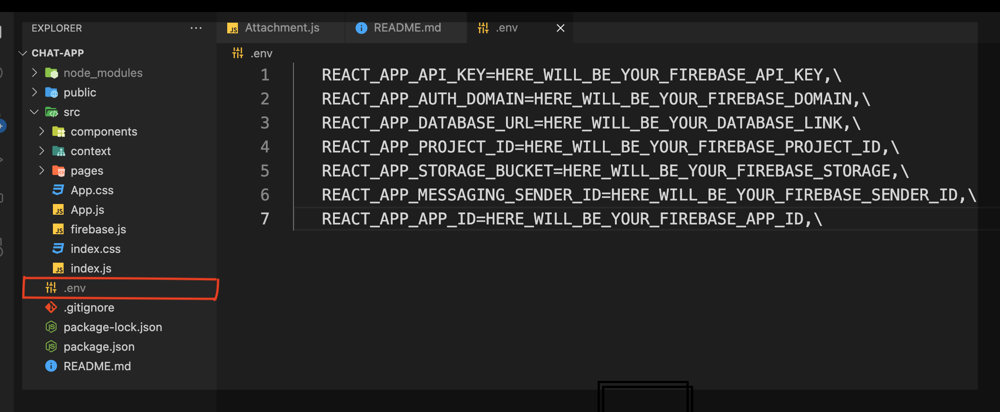

# Private Chat App With React and Firebase version 9.6.1

This project is built with Reactjs and latest Firebase SDK version 9.6.1

# Follow the below instruction to run this project in your pc.👇

## Run the app

## https://github.com/Milan-960/Realtime-ChatApp.git @github/clipboard-copy-element

- Clone this repository 😎

- Run **npm install**

- Run **npm dotenv**

 

## This is the firebase config which you will need to change to run this project with your firebase APIS..

- Create **.env** file at root level of project and add\

  REACT_APP_API_KEY=HERE_WILL_BE_YOUR_FIREBASE_API_KEY,\
   REACT_APP_AUTH_DOMAIN=HERE_WILL_BE_YOUR_FIREBASE_DOMAIN,\
   REACT_APP_DATABASE_URL=HERE_WILL_BE_YOUR_DATABASE_LINK,\
   REACT_APP_PROJECT_ID=HERE_WILL_BE_YOUR_FIREBASE_PROJECT_ID,\
   REACT_APP_STORAGE_BUCKET=HERE_WILL_BE_YOUR_FIREBASE_STORAGE,\
   REACT_APP_MESSAGING_SENDER_ID=HERE_WILL_BE_YOUR_FIREBASE_SENDER_ID,\
   REACT_APP_APP_ID=HERE_WILL_BE_YOUR_FIREBASE_APP_ID,\

- Value of REACT_APP_DATABASE_URL will be https://YOUR-FIREBASE-PROJECT-NAME.firebaseio.com
  simply replace YOUR-FIREBASE-PROJECT-NAME with your project name!!

# Realtime-ChatApp 💬
